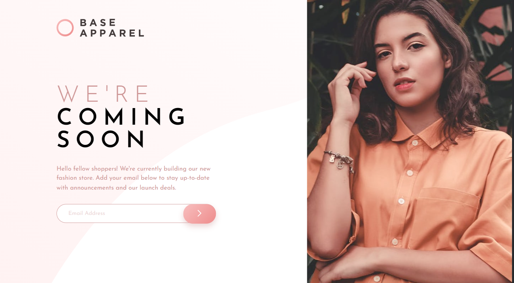
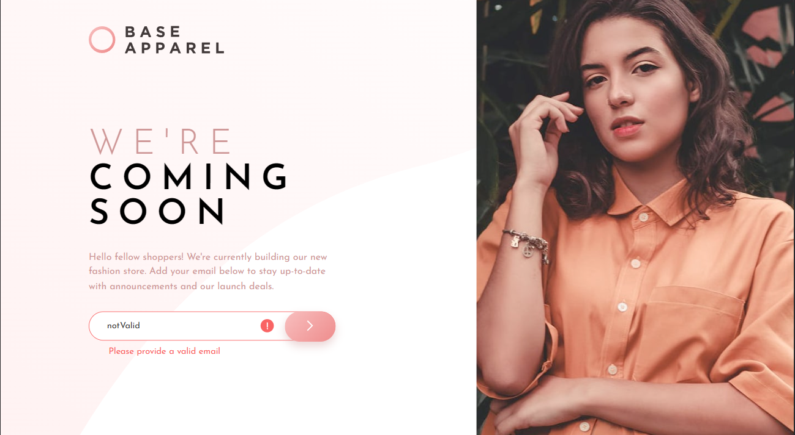
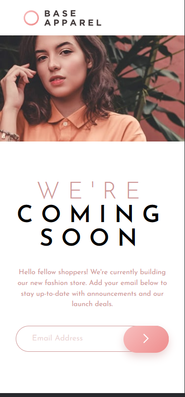

# Hello!😊

## Overview

I had to code the design for Base Apparel landing page. Overall it went quite well although I found it a challenge to make the tablet size responsive but I made a good attempt. I included an extra feature in this challenge including adding a few animations using GSAP just to give it an extra touch.

### Links

- The Live Site URL for this project: [Click here](https://jcasia.github.io/FAQ-Accordion-Card/)
- My Frontend Mentor Username - [@jCasia](https://www.frontendmentor.io/profile/jCasia)

### I built this project using:

- HTML
- CSS GRID
- JavaScript / GSAP

### Here is some screenshots of this project

